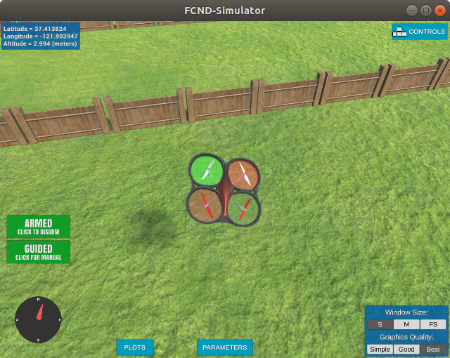

# Udacity Flying Car Nanodegree

_**Special Notes:  Please don't consider running through the projects as a substitute for watching the videos and doing the activities that precede the projects.  In some cases, the time spent on the projects may actually be LESS than the time spent absorbing the material Udacity provides as a precursor.  In that sense, what is presented here might seem disconnected or lacking in the background material necessary to complete the projects with a full appreciation of the techniques or algorithms used.  Additionally, the projects were expected to be run in the confines of an particular Anaconda environment.  Both Machine Learning (especially neural networks) AND the libraries written to implement them are evolving rapidly and you're likely to have some issues running the code in these projects with modern versions of the Python modules used.**_

The Flying Car Nanodegree offered by Udacity in 2018 was a whimsical pursuit to satisfy my craving for learning more from Udacity's wonderful programs.  Unfortunately, this program was cut short after a single term.  I'm not sure where it stands now.  Another drawback was the heavy borrowing of content from other nanodegrees, with the exception of drone control, which was neat to learn about and code myself from fundamental equations.  The projects focused around controller quadcopter drones inside a nicely-built simulator designed by Udacity.  It was a lot of fun and I learned a few tricks along the way.

## Projects
Below is the list of projects from the course, along with links to my solutions.  In each directory, you'll find a README.md written by Udacity, along with some of their helper code.  Generally, the student's view of the project is the Jupyter Notebook files with an .ipynb extension (viewable in GitHub), which is where you'll find the string of guidance, activities, and Q&A that make up the project.  Sometimes, I had to fill in TODO sections in a separate code file.

#### [Backyard Flyer Project](./Backyard-Flyer)

This project was an introductory project in controlling the drone.  The concept was to use a Finite State Machine to handle the logic of progressing through a series of steps necessary to complete a planned flight.  Things like take-off, altitude check and progressing through a series of waypoints were steps that had to be managed.

Here's a photo of the drone zooming off to the next waypoint.  I definitely tuned it to fly aggressively through the waypoints, so it's banking hard!

#### [Motion Planning](./Motion-Planning)

[Report](./Motion-Planning/report.pdf)

In this project, AI, graph-based solutions are used to find a path for the drone through a skyscraper-rich cityscape.  A 3-D map of the city is provided by defining building locations and dimensions.  The drone is given a starting point and destination point with a task of finding the best path.  This is similar to the planning algorithm projects in the Artificial Intelligence Nanodegree.  While it's possible to consider every single possible point as a node in the graph, a stochastic method is used for efficiency.  Basically, a smattering of points are randomly added to open areas of the map and two node are added for the start and destination points.  An A* algorithm is run with that limited set of nodes.  One more step is performed, which is the elimination of points which are unnecessary intermediates - i.e. if I have to travel from A->B->C->D, but I can simply go from A->D safely, then I should simply skip points B and C.

#### [Drone Controller](./Drone-Controller)

[Report](./Drone-Controller/report.pdf)

As can be seen in the report, this project was very formula-heavy, which was actually quite satisfying to work with.  It's really neat to see the mathematical models of physics come to life.

#### [Orientation-Estimation with Extended Kalman Filters](./Orientation-Estimation)

[Report](./Orientation-Estimation/report.pdf)

