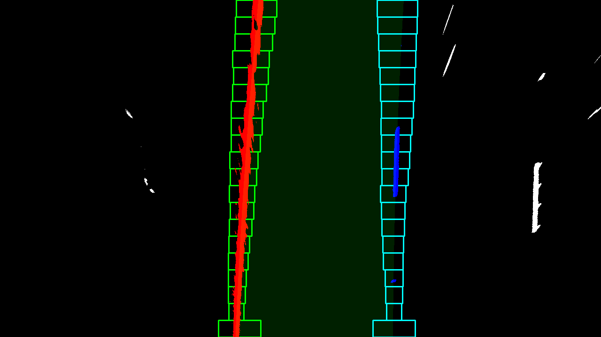
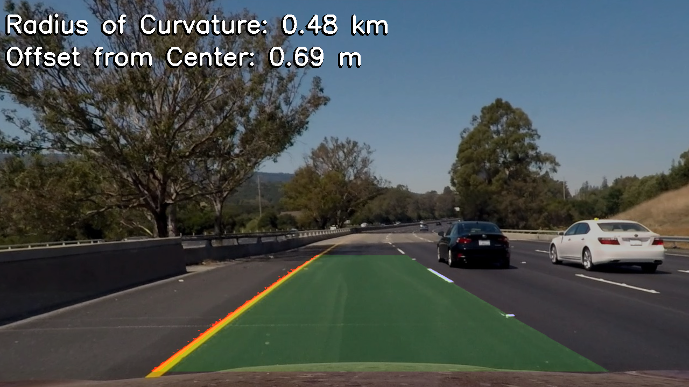
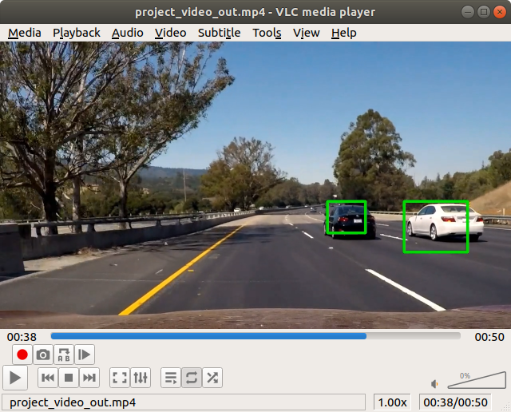
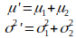
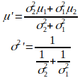

# Udacity Self-Driving Car Nanodegree

_**Special Notes:  Please don't consider running through the projects as a substitute for watching the videos and doing the activities that precede the projects.  In some cases, the time spent on the projects may actually be LESS than the time spent absorbing the material Udacity provides as a precursor.  In that sense, what is presented here might seem disconnected or lacking in the background material necessary to complete the projects with a full appreciation of the techniques or algorithms used.  Additionally, the projects were expected to be run in the confines of an particular Anaconda environment.  Both Machine Learning (especially neural networks) AND the libraries written to implement them are evolving rapidly and you're likely to have some issues running the code in these projects with modern versions of the Python modules used.**_

The Self-Driving Car Nanodegree offered by Udacity in 2017/2018 was one of their flagship nanodegrees, covering a wide range of topics with some of the most thoroughly developed projects.  Sebastian Thrun was the head Stanford's winning entry in the DARPA Grand Challenge and personally appeared in many videos.  I have to admit, this was a very fun nanodegree that I truly looked forward to.  Often, Udacity will teach the same concepts in different nanodegrees, but luckily they always do it in a different way and always seem to introduce some new perspective on the problems.  The simulators provided by Udacity were top-notch and made the learning so much more fun.  I was happy that I had recently built a good machine with a nice GPU to run everything on.  I have many favorite projects in this course and some top ones are Behavioral Cloning (term 1), Semantic Segmentation (term 3), Path Planning (term 3), and Model Predictive Control (term 2).

## Projects
Below is the list of projects from the course, along with links to my solutions.  In each directory, you'll find a README.md written by Udacity, along with some of their helper code.  Generally, the student's view of the project is the Jupyter Notebook files with an .ipynb extension (viewable in GitHub), which is where you'll find the string of guidance, activities, and Q&A that make up the project.  Sometimes, I had to fill in TODO sections in a separate code file.

## Term 1
### [Lab: LeNet](./LeNet-Lab)
[Jupyter Notebook](./LeNet-Lab/LeNet-Lab-Solution.ipynb)

As I stated, topics are reintroduced in various nanodegrees.  In the Artificial Intelligence Nanodegree, Keras was used when dealing with neural networks, however "raw" TensorFlow is used in the Self-Driving Car Nanodegree.  This project introduces the LeNet architecture - one of the first forays of Neural Networks that shocked the world.  This neural network designed by Yan LeCun is famous for excelling at the MNIST challenge, outperforming all other solutions by a wide margin.  In this project, the LeNet-5 architecture is built.

### [Lab: AlexNet Feature Extraction](./AlexNet-Feature-Extraction)
[Feature Extraction Python Script](./AlexNet-Feature-Extraction/feature_extraction_solution.py)

[Training Python Script](./AlexNet-Feature-Extraction/train_feature_extraction_solution.py)

[Traffic Sign Inference Python Script](./AlexNet-Feature-Extraction/traffic_sign_inference_solution.py)

This lab appears to be missing both an extensive Readme.md and any sort of Jupyter Notebook, so I've linked to the python solutions involved instead.  The job here is similar to the dog classifier project in the AIND - use a trained model that's been proven to do a similar task, take the first half of the network (including weights) and tack on new, appropriate layers, and retrain it to classify a different set of classes.  The first few layers may be frozen so that they don't change - this also speeds up the training.  In this example, we'll be taking [AlexNet](https://adeshpande3.github.io/adeshpande3.github.io/The-9-Deep-Learning-Papers-You-Need-To-Know-About.html), which is meant to work with the [ImageNet](https://qz.com/1034972/the-data-that-changed-the-direction-of-ai-research-and-possibly-the-world/) dataset, and using it to classify traffic signs.

A similar lab was done using the Inception, ResNet and VGG networks.

### [Traffic Sign Classifier](./Traffic-Sign-Classifier)

[Jupyter Notebook](./Traffic-Sign-Classifier/Traffic_Sign_Classifier.ipynb)

[Report](./Traffic-Sign-Classifier/report.pdf)

A training accuracy of 99% and a test accuracy of 97.4%?  Pretty good!  I'll let the [report](./Traffic-Sign-Classifier/report.pdf) do most of the talking about this one.  In general, the purpose of this project was to identify European traffic signs using a Convolutional Neural Network (CNN).  The project uses a modified LeNet CNN trained from scratch.  Skip Layers were used to improve accuracy.  Feature extraction and visualization were incorporated to give some feedback about what the neural network is attempting to identify in the images.

Topics:
* Preprocessing
    * Image scaling
    * White balancing
    * Normalization
    * Greyscale
* Data Augmentation
    * Obfuscation
    * Shifting
    * Rotating
* Neural Network Design
    * Layer skipping
    * Feature Map Visualization

### [Behavioral Cloning](./Behavioral-Cloning)
[Jupyter Notebook](./Behavioral-Cloning/Behavioral_Cloning_Final.ipynb)

[Report](./Behavioral-Cloning/writeup_report.pdf)

[Stand Out Task (MP4 VIDEO)](./Behavioral-Cloning/video_mountain_right_lane_only.mp4)

[Basic Pass (MP4 VIDEO)](./Behavioral-Cloning/video.mp4)

I started to get a bit cocky at this point, due to how powerful I was finding these neural networks to be, especially on this task.  The task was to drive a car in a simulator around a track manually, recording steering angles and screenshots as you went, then use that saved data to train a neural network to steer based on screenshots.  The required "mph" for the basic run was 9mph.  Additionally, there was a "stand-out" task of a mountain course, which I not only got to run, but got to run at 20mph.... and kept the car in the right lane (ok, most of the time)!  A fun part of this project was hooking up my Xbox 360 controller to the PC to avoid having to use a keyboard to keep the car between the lines.

Topics:
* Preprocessing
    * Performing PreProc on the GPU
    * Clipping
    * Normalization
* Neural Network Design
   * Dropout Layers

### [Lane Lines](./Lane-Lines)

[Jupyter Notebook](./Lane-Lines/P1.ipynb)

[Report](./Lane-Lines/report.pdf)

[Video 1](./Lane-Lines/solidWhiteRight.mp4)

[Video 2](./Lane-Lines/solidYellowLeft.mp4)

[Challenge Video](./Lane-Lines/challenge.mp4)

This project using OpenCV operations to detect lane lines in images.  As mentioned in the [report](./Lane-Lines/report.pdf), the first step is Canny Edge Detection, which is followed by probabilistic Hough transform.  A region of interest is also enforced, which helps avoid detecting edges in traffic signs and the like.  At this point, equations for the lines are derived and lines are overlayed on to the original image as a feedback mechanism.

### [Advanced Lane Lines](./Advanced-Lane-Lines)

[Jupyter Notebook](./Advanced-Lane-Lines/Advanced_Lane_Finding_Final.ipynb)

[Report](./Advanced-Lane-Lines/report.pdf)

[Video 1](./Advanced-Lane-Lines/project_video_out.mp4)

[Challenge Video](./Advanced-Lane-Lines/challenge_video_out.mp4)

 

This lane finder project incorporates camera lens distortion correction, colorspace conversion and thresholding, (coolest of all) perspective transformation, curvature calculation, overlaying lines and finally perspective transformation reversal.  Important takeaways are that thresholding can be extremely temperamental and so can curvature parameters made in an expanded space where errors may be magnified.  In the report, I indicate that the challenge video was a failure, but looking at it now I see that the performance is pretty good (although not perfect).

### [Vehicle Detection](./Vehicle-Detection)

[Jupyter Notebook](./Vehicle-Detection/Vehicle_Detection_v1.ipynb)

[Report](./Vehicle-Detection/report.pdf)

[Video](./Vehicle-Detection/project_video_out.mp4)

The project starts off by training an SVM classifier on the Histogram of Oriented Gradients (HOG) features calculated from a dataset of images of rear views of cars and not-cars.  This means we now have something that, given a 64x64 image, can fairly quickly/cheaply tell us whether or not a car is in the image.  In order to leverage this classifiers, windows of various sizes are slid around the car camera image.  The windowed sample is converted to 64x64 and a car detection is performed.  Because the results can be noisy, heatmapping is used to overlay multiple, consistent detections, and a threshold is used to trigger an "overall" detection.  The report has some good discussion about the tradeoffs involved and possible improvements.

## Term 2

### Some Kalman Filter Notes
The next two projects (Extended Kalman Filter, EKF and Unscented Kalman Filter, UKF) each deal with Kalman filters (obviously).  There were no reports and README.md's or Jupyter notebooks for those projects, just some C++ code.  As such, I'm including some general notes on Kalman filters here to convey some of the theory behind the projects.  I won't try to compete with Wikipedia's entry (https://en.wikipedia.org/wiki/Kalman_filter), but should mention a few concepts to introduce the projects.

#### Noisy Measurements - one of the general ideas behind Kalman filters
The general idea behind the Kalman filter is a recognition of noisy measurements and noisy processes - more specifically, it's the combination of multiple, noisy measurements to improve the overall measurement accuracy.  The underlying thought is:  all your measurements and predictions that are based on measurements are distributions that reflect uncertainty, not points of perfect knowledge.  An assumption made is that noises are independent and Gaussian.

When we are adding two noisy values, we get the following equations:

The new mean and variance are simply the result of adding the values.  This is distinct from *combining* values, which is what the Kalman filter is based on. 

When we have two direct, noisy measurements of the same value, we can combine them with these equations:

Now we can see that the new mean is a weighted average of the previous means, using their corresponding variances as weights.  The new variance inverse of the sum of the inverses of the previous variances (I'm not sure what this type of formula is called, but I might refer to as the "parallel net value").  This new variance will *always* be smaller than either of the two variances used to determine it.  In cases where the two original variances are equal, the resulting variance will be half of the previous two.

So what should be done in cases where:
* what you want to measure is changing systematically
* you can't measure what you want to know directly, but you can model the connection between the two
* there are inputs (aka controls) to the system - such as a steering wheel or gas pedal

#### Basic Kalman Filter

If the equations that connect:
* the state of the system to the measured values
* the state of the system to the inputs
... can be represented by linear equations, then you can use a basic Kalman filter.

The basic steps behind the Kalman filter are:
* you've got an estimate of your state (say, position and velocity of an object moving in 1D) and uncertainy matrix
* you update your state, given some change in time.  you also update your uncertainty matrix due to process noise
* you make some measurement
* you create an error term by finding the difference between your measurement and a conversion of the predicted state space to measurement space
* you find a gain matrix, the Kalman gain, by projecting your uncertainy matrix into the measurement space and adding in your measurement noise
* you use the Kalman gain as a multiplier when updating your state estimate with the error term
* you also use the Kalman gain to update your uncertainy matrix so it reflects your introduced measurement noise combined with how "off" your state estimate is already

The basic Kalman filter achieves all of this iff you're dealing with linear systems.

#### Extended Kalman Filter

#### Unscented Kalman Filter

#### Predicting Mean and Covariance

### [Extended Kalman Filter](./)
### [Unscented Kalman Filter](./)
### [Model Predictive Control](./)
### [PID Controller](./)
### [Kidnapped Vehicle Project](./)

## Term 3
### [Path Planning](./)
### [Semantic Segmentation](./)
### [Capstone](./)
